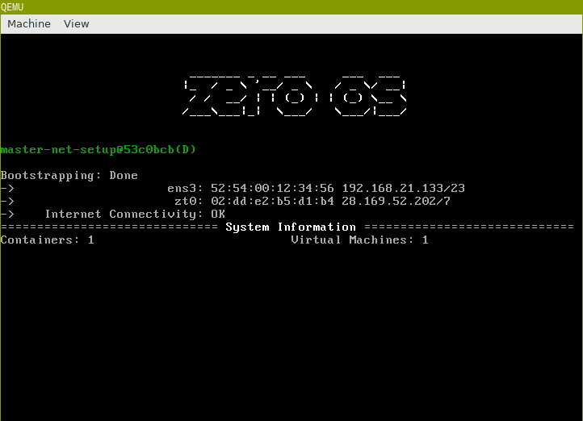

# Documentation

The [`/docs`](/docs) directory of this (home) repository is quite empty since all documentation is in the **/docs** directories of the main G8OS repositories, listed here below.

In [Getting Started](gettingstarted/gettingstarted.md) you find the recommended path to quickly get up and running with G8OS.

# Main repositories

- [Builders for G8OS initramfs](https://github.com/g8os/initramfs): Build instructions & scripts
- [G8OS Core0](https://github.com/g8os/core0): Init process and container manager of G8OS
  - Also contains Python client for Core0, allows to manage containers, disks and networking of a G8OS node
- [G8OS File System](https://github.com/g8os/g8ufs): Virtual file system for G8OS and G8OS containers
- [G8OS Block Storage](https://github.com/g8os/blockstor): NBD based distributed block storage server
- [G8OS Resource Pool](https://github.com/g8os/resourcepool): G8OS resource pool API server and AYS templates
  - Also contains RAML definition and Python stubs to interact with the RESTfull resource pool API
- [G8OS Hub](https://github.com/g8os/hub): Repository for flists and vdisk templates
  - Publicly hosted on https://hub.gig.tech

# Release schedule

- Dec 7, 2016: [v0.9.0](https://github.com/g8os/core0/releases/tag/v0.9.0)
  - First usable beta version of the G8OS
- May 12, 2017: [v1.1.0-alpha-2](https://github.com/g8os/home/blob/master/milestones/1.1.0-alpha-2.md) :
  - Introduces
    - Hub
    - Resource Pool
    - NBD Block Storage server
  - [Kanban](https://waffle.io/g8os/home?milestone=v1.1.0-alpha-2)
- May 26, 2017: [v1.1.0-alpha-3](https://github.com/g8os/home/blob/master/milestones/1.1.0-alpha-3.md)
  - Introduces
    - G8OS Gateway
    - Redundant vdisks
    - Upgrade of service to JumpScale 9
  - [Kanban](https://waffle.io/g8os/home?milestone=v1.1.0-alpha-3)
- June 9, 2017: [v1.1.0-alpha-4](https://github.com/g8os/home/blob/master/milestones/1.1.0-alpha-4.md)
  - Introduces:
    - Basic integration with OpenvCloud
    - vdisk rollback
    - Automatic handling of storage failures and all components authenticated over ItsYou.online
  - [Kanban](https://waffle.io/g8os/home?milestone=v1.1.0-alpha-4)

# Telegram

- https://telegram.me/joinchat/BrOCOUGHeT035il_qrwQ2A
