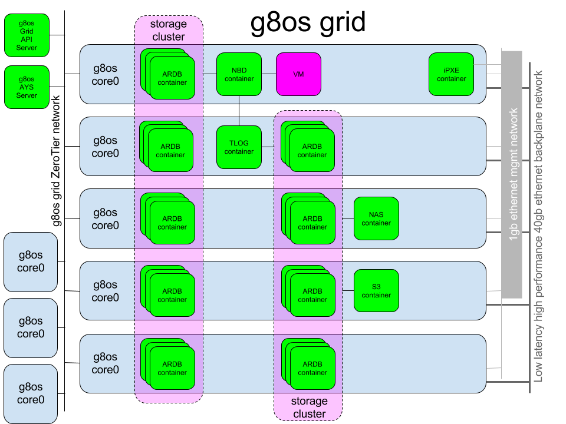

# G8OS Grid

A G8OS Grid is a **cluster of G8OS nodes**, in the below picture 8 physical nodes, 5 local and 3 remote nodes, all connected through a ZeroTier network.

Next to the the G8OS nodes, a G8OS grid includes the following components:
- One **Grid API Server**, exposing all the APIs to manage and interacting with the grid
- One **AYS Server**, for managing the full lifecycle of both the grid and the actual workloads (applications)
- One **iPXE Server** from which all G8OS nodes boot

Both the **Grid API Server**, the **AYS Server** and the **iPXE Server** run in a container on one of the G8OS grid nodes, or on any other local or remote host, connected to the same ZeroTier network as the other G8OS nodes in the grid.

In addition a G8OS grid typically also includes one or more **Storage Clusters**, implemented as clusters of (ARDB) key-value stores running in containers hosted on the G8OS grid nodes. In the below picture two storage clusters are shown:
- One for implementing a block storage backend, exposed through NBD servers, one for each each virtual machine using virtual disks from the block storage backend
- Another one implementing the backend for the TLOG server, needed by the NBD servers

Furthermore the above setup shows a NAS server and a S3 server, both running in a container, and both connected to the second storage cluster, the same one that is used by the TLOG server.

For more details see:
* [Setting up the Grid](setup/setup.md)
* [Storage Cluster](storagecluster.md)
* [Grid API](api.md)
